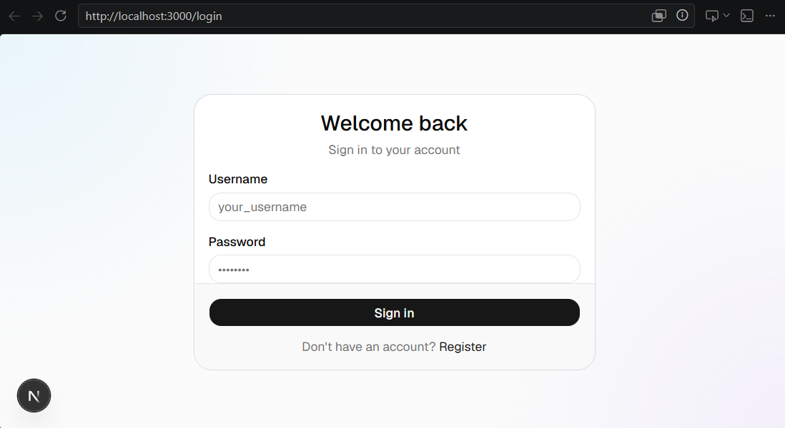
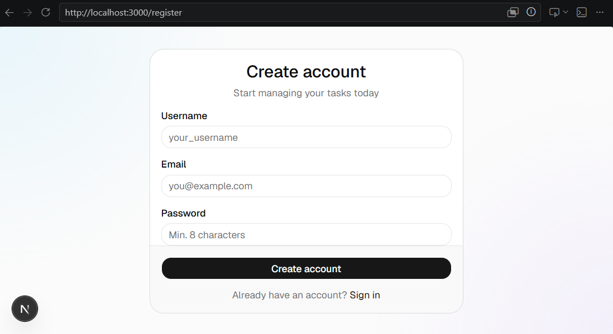
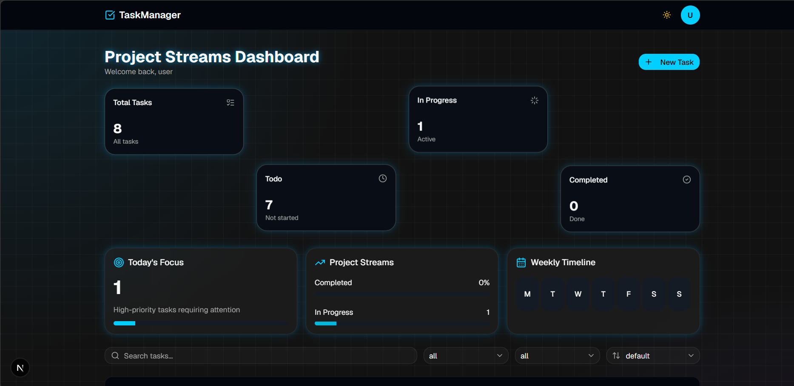
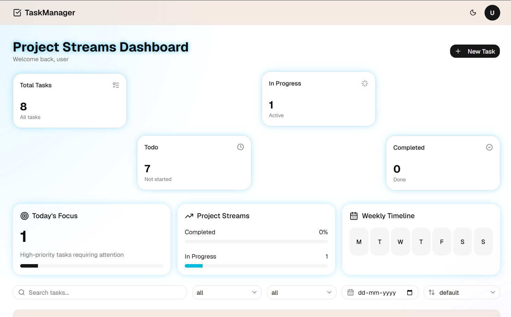
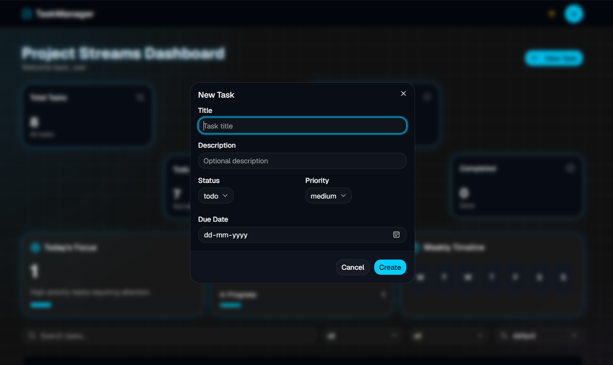
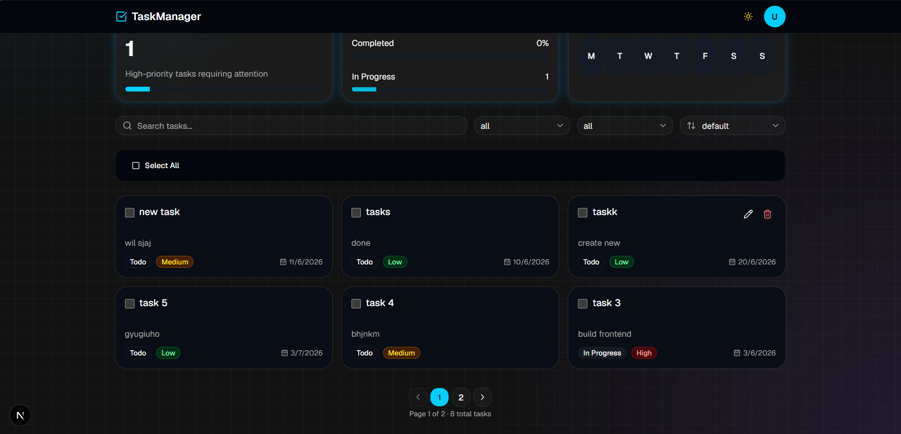

# TaskManager

A full-stack task management dashboard with a **Next.js 16** frontend and a **Django REST Framework** backend, connected via JWT authentication.

---

## Tech Stack

### Frontend

| Technology | Version | Purpose |
|---|---|---|
| Next.js | 16.2.7 | React framework (App Router) |
| TypeScript | ^5 | Static typing |
| Tailwind CSS | ^4 | Utility-first styling |
| shadcn/ui | ^4.10.0 | Component library (base-ui) |
| Axios | ^1.16.1 | HTTP client with interceptors |
| Sonner | ^2.0.7 | Toast notifications |
| Lucide React | ^1.17.0 | Icon set |
| js-cookie | ^3.0.8 | JWT cookie management |
| Jest | ^29 | Unit testing |
| React Testing Library | ^16 | Component testing |

### Backend

| Technology | Version | Purpose |
|---|---|---|
| Django | ^4 | Web framework |
| Django REST Framework | ^3 | REST API |
| SimpleJWT | ^5 | JWT authentication |
| SQLite | — | Development database |

---

## Project Structure

```
TM- 1/
├── backend/                        # Django REST Framework API
│   ├── core/                       # Django project settings
│   │   ├── settings.py             # Project configuration
│   │   ├── urls.py                 # Root URL routing
│   │   ├── asgi.py
│   │   └── wsgi.py
│   ├── tasks/                      # Main Django app
│   │   ├── migrations/             # Database migrations
│   │   ├── models.py               # Task model (title, description, status, priority, due_date)
│   │   ├── serializers.py          # DRF serializers
│   │   ├── views.py                # API views (list, create, update, delete, stats)
│   │   ├── urls.py                 # Task API routes
│   │   ├── auth_urls.py            # Auth routes (login, register, refresh, profile)
│   │   └── tests.py                # Django test cases
│   ├── manage.py
│   └── requirements.txt            # Python dependencies
│
└── frontend/                       # Next.js App Router
    ├── __tests__/                  # Jest unit tests
    │   ├── api.utils.test.ts       # ApiError + handleApiError tests
    │   ├── StatsCard.test.tsx      # StatsCard component tests
    │   ├── TaskBadge.test.tsx      # TaskBadge component tests
    │   ├── TaskCard.test.tsx       # TaskCard component tests
    │   └── Pagination.test.tsx     # Pagination component tests
    │
    ├── api/                        # API layer
    │   ├── endpoints/
    │   │   ├── auth.ts             # Auth endpoint definitions
    │   │   └── tasks.ts            # Task endpoint definitions
    │   ├── services/
    │   │   ├── authService.ts      # Auth service (login, register, logout, profile)
    │   │   └── taskService.ts      # Task service (CRUD, bulk actions, stats)
    │   ├── client.ts               # Axios instance + JWT interceptors (auto-refresh)
    │   ├── utils.ts                # ApiError class + handleApiError
    │   └── index.ts                # Re-exports
    │
    ├── app/                        # Next.js App Router pages
    │   ├── (auth)/                 # Unauthenticated route group
    │   │   ├── layout.tsx          # Centered full-screen layout
    │   │   ├── login/
    │   │   │   └── page.tsx        # Login page — client component
    │   │   └── register/
    │   │       └── page.tsx        # Register page — client component
    │   ├── dashboard/
    │   │   └── page.tsx            # Protected dashboard — client component
    │   ├── globals.css             # Global styles + Tailwind + shadcn CSS variables
    │   ├── layout.tsx              # Root layout — server component (AuthProvider + Toaster)
    │   └── page.tsx                # Root redirect — server component (reads cookie → redirect)
    │
    ├── components/
    │   ├── tasks/
    │   │   ├── TaskBadge.tsx       # Status badge (Todo / In Progress / Completed)
    │   │   ├── TaskCard.tsx        # Task card with checkbox, edit, delete actions
    │   │   ├── TaskForm.tsx        # Create / Edit task dialog
    │   │   ├── BulkActionBar.tsx   # Bulk select / mark / delete toolbar
    │   │   ├── ProjectStreams.tsx   # Progress bars widget
    │   │   └── Timeline.tsx        # Weekly timeline widget
    │   ├── ui/                     # shadcn/ui auto-generated components
    │   ├── Navbar.tsx              # Sticky navbar with user avatar dropdown + theme toggle
    │   ├── Pagination.tsx          # Page navigation with ellipsis
    │   ├── StatsCard.tsx           # Metric summary card
    │   └── ThemeToggle.tsx         # Light / dark mode toggle
    │
    ├── hooks/
    │   └── useAuth.tsx             # AuthContext — user state, login, logout
    │
    ├── lib/
    │   └── utils.ts                # cn() utility (clsx + tailwind-merge)
    │
    ├── types/
    │   └── index.ts                # All TypeScript interfaces and types
    │
    ├── .env.local                  # Environment variables
    ├── jest.config.ts              # Jest configuration
    ├── next.config.ts
    ├── package.json
    └── tsconfig.json
```

---

## Setup

### Prerequisites

- Node.js >= 18
- Python >= 3.10
- pip

---

### 1. Clone the repository

```bash
git clone <repo-url>
cd "TM- 1"
```

---

### 2. Backend Setup

```bash
cd backend
python -m venv venv
```

Activate the virtual environment:

- Windows: `venv\Scripts\activate`
- macOS/Linux: `source venv/bin/activate`

```bash
pip install -r requirements.txt
python manage.py migrate
python manage.py runserver
```

The backend will be running at `http://localhost:8000`.

---

### 3. Frontend Setup

```bash
cd frontend
npm install
```

Create `.env.local` in the `frontend/` root:

```env
NEXT_PUBLIC_API_URL=http://localhost:8000/api
```

```bash
npm run dev
```

Open [http://localhost:3000](http://localhost:3000)

---

### 4. Build for Production

```bash
# Frontend
cd frontend
npm run build
npm run start
```

---

### 5. Lint

```bash
cd frontend
npm run lint
```

---

## Pages

### `/` — Root
Server component. Reads the `access` cookie and redirects to `/dashboard` if authenticated, or `/login` if not. No client JS involved.

### `/login`
- Username + password form
- On success: stores JWT tokens in cookies, redirects to `/dashboard`

### `/register`
- Username, email, password form
- On success: redirects to `/login`
- Displays field-level validation errors from the API

### `/dashboard`
- Protected — redirects to `/login` if unauthenticated
- Stats grid: Total / Todo / In Progress / Completed
- **Today's Focus** card — click to filter high-priority tasks due within the next 3 days
- **Project Streams** card — completion and in-progress progress bars
- **Weekly Timeline** card
- Search by title / description
- Filter by status, priority, due date
- Sort by due date, created date, priority
- Bulk select → mark as / delete
- Responsive task grid (1 → 2 → 3 columns)
- Paginated results (6 per page)

---

## Screenshots

### Login Page


### Register Page


### Dashboard (Dark Mode)


### Dashboard (Light Mode)


### Create Task


### Pagination


---

## Components

### `TaskCard`
Displays a single task — title, description preview, status badge, priority badge, due date. Checkbox for bulk selection. Hover reveals Edit / Delete buttons.

### `TaskForm`
shadcn Dialog for creating or editing a task. Fields: title, description, status, priority, due date.

### `TaskBadge`
Maps `TaskStatus` to a shadcn `Badge` variant:
- `todo` → outline
- `in_progress` → secondary
- `completed` → default

### `BulkActionBar`
Appears when one or more tasks are selected. Allows marking all selected tasks as a status or bulk deleting.

### `Pagination`
Renders page number buttons with ellipsis for large page ranges. Hides itself when there is only 1 page.

### `Navbar`
Sticky header with app logo, theme toggle, and user avatar dropdown (username, email, sign out).

### `StatsCard`
shadcn `Card` displaying a label, numeric count, icon, and description.

---

## API Integration

### Axios Client (`api/client.ts`)
- **Request interceptor:** Attaches `Authorization: Bearer <access_token>` from cookies
- **Response interceptor (401):** Calls `/auth/refresh/`, updates the access cookie, retries the original request. Redirects to `/login` if refresh fails.

### Endpoints

| Function | Method | Endpoint |
|---|---|---|
| `login` | POST | `/auth/login/` |
| `register` | POST | `/auth/register/` |
| `getProfile` | GET | `/auth/profile/` |
| `getTasks` | GET | `/tasks/?status=&priority=&search=&due_date=&due_date_from=&due_date_to=&ordering=&page=` |
| `getStats` | GET | `/tasks/stats/` |
| `createTask` | POST | `/tasks/` |
| `updateTask` | PATCH | `/tasks/:id/` |
| `deleteTask` | DELETE | `/tasks/:id/` |
| `bulkUpdateStatus` | PATCH | `/tasks/:id/` × N |
| `bulkDelete` | DELETE | `/tasks/:id/` × N |

---

## Types

Defined in `types/index.ts`:

```ts
type TaskStatus   = "todo" | "in_progress" | "completed"
type TaskPriority = "low" | "medium" | "high"

interface User            { id, username, email }
interface Task            { id, title, description, status, priority, due_date, created_at, updated_at }
interface TaskStats        { total, todo, in_progress, completed, high, medium, low }
interface AuthTokens      { access, refresh }
interface TaskFormData     { title, description, status, priority, due_date }
interface TaskFilters      { status?, priority?, search?, ordering?, due_date?, due_date_from?, due_date_to?, page? }
interface LoginFormData    { username, password }
interface RegisterFormData { username, email, password }
```

---

## Authentication Flow

```
User visits /
    └── Has access cookie? (checked server-side)
        ├── YES → /dashboard
        └── NO  → /login
                    └── Login success
                            └── Store access + refresh in cookies
                                └── /dashboard
                                        └── 401 response?
                                                └── Auto-refresh access token
                                                        └── Retry request
                                                                └── Refresh failed → /login
```

JWT access token expires in **1 day**, refresh token in **7 days**.

---

## Unit Tests

Tests live in `frontend/__tests__/` and are run with Jest + React Testing Library.

### Run Tests

```bash
cd frontend
npm test
```

### Watch Mode

```bash
npm run test:watch
```

### Test Suites

| File | What it tests |
|---|---|
| `api.utils.test.ts` | `ApiError` constructor, `toDisplayMessage` with and without field errors, `handleApiError` — detail field, field errors, fallback, non-array values |
| `StatsCard.test.tsx` | Renders title, count, description correctly; handles zero count |
| `TaskBadge.test.tsx` | Correct label rendered for each of the 3 task statuses |
| `TaskCard.test.tsx` | Renders title, description, priority, due date; hides due date when null; applies selected ring; checkbox / edit / delete callbacks fire with correct arguments |
| `Pagination.test.tsx` | Hidden when totalPages is 1; renders correct page buttons; prev disabled on page 1; next disabled on last page; correct page passed to callback; ellipsis shown for large ranges |

### Example Output

```
PASS __tests__/api.utils.test.ts
PASS __tests__/TaskBadge.test.tsx
PASS __tests__/StatsCard.test.tsx
PASS __tests__/Pagination.test.tsx
PASS __tests__/TaskCard.test.tsx

Test Suites: 5 passed, 5 total
Tests:       27 passed, 27 total
```

---

## Environment Variables

| Variable | Default | Description |
|---|---|---|
| `NEXT_PUBLIC_API_URL` | `http://localhost:8000/api` | Django backend API base URL |

---

## Design Decisions

### 1. Modern Dashboard-First Interface

Instead of a traditional table-based task manager, the application is designed as a dashboard that provides an immediate overview of project progress. The top section displays key metrics — Total, Todo, In Progress, and Completed — so users understand project status at a glance without navigating through multiple pages.

### 2. Visual Project Streams Layout

Stat cards are arranged in a staggered pattern rather than a standard grid. This creates visual hierarchy, draws attention to important metrics, and makes the interface look more modern and engaging — differentiating it from basic CRUD dashboards.

### 3. Priority-Based Productivity

A dedicated **Today's Focus** section highlights urgent work. Clicking it filters tasks to show only high-priority, incomplete tasks due within the next 3 days, helping users quickly identify what requires immediate attention.

### 4. Progress Visualization

The **Project Streams** card shows progress bars for completed and active work alongside raw numbers. This improves readability and supports faster decision-making compared to numbers alone.

### 5. Weekly Timeline Overview

A lightweight weekly timeline component provides temporal context for task planning. It improves schedule awareness and serves as a foundation for future timeline enhancements.

### 6. Card-Based Task Management

Tasks are displayed as individual cards rather than table rows. Cards offer better mobile responsiveness, easier scanning of task information, clear visual separation, and a more engaging interface. Each card shows title, description, status, priority, due date, and quick actions.

### 7. Minimal Action Visibility

Edit and Delete buttons are hidden until the user hovers over a task card. This reduces visual clutter, keeps focus on task content, and surfaces actions only when needed.

### 8. Modal-Based Create and Edit Flow

Task creation and editing use modal dialogs so users stay on the dashboard without any page navigation. The same `TaskForm` component is reused for both creating and updating tasks.

### 9. Advanced Filtering and Search

To handle larger task lists, the dashboard provides search by title or description, status filtering, priority filtering, due date filtering, and sort options. These controls let users locate relevant tasks quickly.

### 10. Dark Mode by Default

The application uses a dark theme with cyan/neon blue accents. This reduces eye strain, looks modern, and provides consistent visual contrast. The accent color is applied consistently across buttons, progress indicators, focus states, and stat cards.

### 11. Responsive Design

The layout adapts across device sizes — single column on mobile, two columns on tablet, and a multi-column dashboard layout on desktop — ensuring usability on any screen size.

### 12. Component-Based Architecture

The frontend uses a reusable component architecture (`TaskCard`, `TaskForm`, `TaskBadge`, `StatsCard`, `Navbar`, etc.). This reduces code duplication, improves maintainability, enables scaling, and makes individual units easy to test in isolation.

### 13. Authentication Experience

JWT tokens are stored in cookies rather than localStorage. This enables server-side authentication checks — the root `/` page is a Next.js Server Component that reads the cookie and redirects users to `/dashboard` or `/login` before any client JS runs. The Axios client handles automatic token refresh on 401 responses, making the session seamless.
